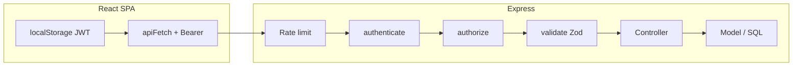

# Ledger — system design & architecture

This document explains how the Ledger backend and frontend fit together: authentication, layering, data flow, and how we keep the codebase maintainable.

---

## What this app does

A small **finance dashboard**: **admins** maintain transactions and users; **analysts** **read** line-level records and use the same dashboard insights as **viewers**; **viewers** use **dashboard-only** APIs (no Records list/detail). Team management is admin-only.

---

## High-level data flow

1. **Browser** stores a **JWT** in `localStorage` after login (`frontend/src/api/client.js`).
2. Each API call sends `Authorization: Bearer <token>`.
3. **Express** runs **global middleware** (Helmet, CORS, JSON body, logging, rate limit on `/api`).
4. The **router** for `/api/*` attaches **sanitize**, then domain routers (`routes/index.js`).
5. **Per-route middleware** runs in order: `authenticate` (JWT) → `authorize` (RBAC) → optional `validate` (Zod) → rate limiters where configured → **controller** → **model** (SQL via `pg`).
6. Responses are JSON; **errorHandler** turns thrown `ApiError` into consistent HTTP status + message.

---

## Authentication (no server-side sessions)

We use **stateless JWTs**:

- **Login** verifies email/password against Postgres (`user.model`), then **`signToken`** embeds `{ id, role, email }` (normalized in `utils/jwt.js` + `utils/authUser.js`).
- **No session table** — the server does not store “logged-in sessions”. Expiry is in the JWT (`JWT_EXPIRES_IN`).
- **Logout** is client-side: remove token from `localStorage`.
- **Optional auth** (`optionalAuth.js`) is used for register-after-first-user: admin token optional on `POST /auth/register`.

**Guards** in this codebase are **Express middleware**, not decorators (Node has no built-in decorators like Nest/TypeScript):

| Layer | File | Role |
|--------|------|------|
| Auth | `middleware/auth.js` | Requires `Authorization: Bearer`, sets `req.user` |
| RBAC | `middleware/rbac.js` | `authorize(['admin', …])` checks `req.user.role` |
| Validation | `middleware/validate.js` | Zod parse for `body` / `query` / `params` |
| Rate limit | `middleware/rateLimit.js` | IP / per-user buckets after auth |

**Policy-style checks** that don’t fit a generic role list live in **controllers** (e.g. “only primary admin can change primary admin email”, “cannot remove primary admin”).

---

## Roles (business logic)

| Role | Dashboard | Records API | Team |
|------|-----------|-------------|------|
| **Viewer** | Read-only aggregates (summary, categories, trends, recent activity) | **No access** (meets “dashboard only”) | No |
| **Analyst** | Same dashboard endpoints as viewer | **GET** list + detail only (view records & insights; **no** create/update/archive) | No |
| **Admin** | Full dashboard | **Full CRUD** + soft-delete (archive) records | Yes (create/update/deactivate/soft-remove users) |

**Deactivate** (`DELETE /users/:id`) sets `is_active = false` — user can be **Activate**d again via PATCH.  
**Remove** (`POST /users/:id/remove`) sets **`deleted = true`** (soft delete) — user no longer appears in lists and cannot log in.

---

## Soft delete everywhere (data layer)

| Entity | Mechanism |
|--------|-----------|
| **financial_records** | `deleted = TRUE` |
| **categories** | `deleted_at` timestamp |
| **users** | `deleted = TRUE` + `deleted_at` (removed from org) |

Queries always filter **active** users (`deleted` not true) for login and list.

---

## Rate limiting

Configured in `middleware/rateLimit.js`:

- Broad **API** limiter on `/api` (see `app.js`).
- **Login / register** stricter limits on auth routes.
- After JWT, **read** vs **write** limiters use `user.id` in the key when possible (with `ipKeyGenerator` for IPv6 safety).

Environment variables (optional): `RATE_LIMIT_API_MAX`, `RATE_LIMIT_LOGIN_MAX`, `RATE_LIMIT_REGISTER_MAX`, `RATE_LIMIT_AUTH_READ_MAX`, `RATE_LIMIT_AUTH_WRITE_MAX`.

---

## Maintainability

- **One responsibility per folder**: `routes` wire HTTP, `controllers` orchestrate, `models` own SQL, `validation` owns Zod schemas.
- **Shared rules** (password strength, user normalization) live in `utils/` so validation and docs stay aligned.
- **Migrations** in `sql/migrations/` — `npm run db:migrate` runs all `*.sql` files in order.

---

## Frontend structure (short)

- `AuthContext` holds user + helpers (`isAdmin`, `canSeeInsights`).
- **Dashboard** loads summary + recent for everyone; charts load when `canSeeInsights` includes the viewer role (org-wide read-only).
- **Team** page calls PATCH for activate, DELETE for deactivate, POST `.../remove` for soft delete.

---

## Workflow of a typical request (example)

**PATCH `/api/users/5`**

1. `app.js` → `apiRateLimiter` → `api` router → `sanitizeInput`.
2. `user.routes` → `authenticate` → JWT verified → `req.user` set.
3. `authorize(['admin'])` → must be admin.
4. `authReadLimiter` skipped on PATCH; `authWriteLimiter` runs.
5. `validate(idParamSchema)` on params, `validate(patchUserSchema)` on body.
6. `user.controller.patchUser` → verify actor password → **primary admin email policy** → `updateUser` in model.
7. JSON response; errors go through `errorHandler`.

---

## Scalability notes

- Stateless JWT scales horizontally (no sticky sessions).
- DB pool in `config/db.js` — tune pool size for your host.
- For heavier analytics later, move aggregates to materialized views or a read replica; the current design keeps SQL in one place (`models`) so that swap is localized.
